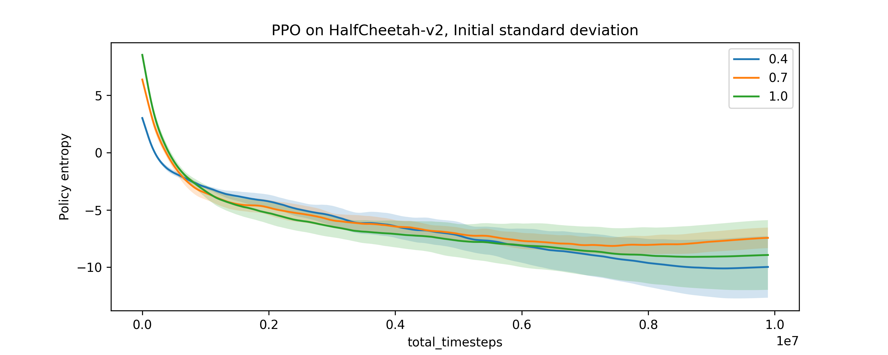

> TL;DR: Some environments defy the "gravity" of RL / deep learning.

I have been toying with deep reinforcement learning (RL) for almost the past year, especially on Mujoco continuous control tasks. If you have taken any deep learning course / reinforcement learning course, you might have this intuition:

- Exploration is good.
- Momentum accelerates training.

However, on two specific environments and SOTA algorithms, I was able to show the reverse is true.

### Exploration seems to be bad on HalfCheetah with PPO

The first example considers HalfCheetah(-v1/v2) environments on OpenAI gym, and the popular Proximal Policy Optimization algorithm . It is able to achieve significantly higher sample efficiency by tuning down the **initial value** for standard deviation in the (parametrized) policy distribution. See this:

{:.center}

Although having larger **initial** standard deviation should give better (random) exploration, the sample complexity is much worse than with smaller **initial** standard deviation.

{:.center}

One would argue that maybe it is because the default standard deviation is 1, yet Mujoco tasks typically clip at [-1, 1], so it might be caused by higher variance in policy. However, this is not the case. In fact, the entropies of the policies drop to the same level, so the difference in reward cannot be caused by higher policy variance. Moreover, these policies seem to have converged to a local minimum, which seems to contradict with the argument that "exploration is good"!

### Momentum seems to be bad for Walker with ACKTR

The second example considers Walker2d(-v2) environments on OpenAI gym, and another popular algorithm, Actor-Critic with Kroneker factors and Trust Region (ACKTR) . This time, we reduce the momentum from 0.9 to 0 for the policy KFAC optimizer, and again show a consistent improvement in sample complexity.

{:.center}

Again, this is weird, since momentum seems extremely useful in the case of supervised learning, and almost everyone uses it. However, on this environment the introduction of momentum seems to have an adverse effect.

### How to reproduce?

Don't take my code for granted. It is easy to reproduce these by yourself:
- Clone [OpenAI baselines](https://github.com/openai/baselines)
- For PPO, modify the initial standard deviation value `logstd` in the policy network (in `ppo1.mlp_policy.MlpPolicy`)
- For ACKTR, modify the momentum value in the `kfac.KFACOptimizer` (in `acktr.acktr_cont.learn()`)
- Run multiple random seeds!
- Enjoy!

### Acknowledgements
I would like to thank Yuhuai Wu for discussion on the HalfCheetah case, and Yang Song for inspiring the discovery on the second case.

I have not tried the second case extensively, but the first case works on HalfCheetah most significantly; on environments other than Humanoid, the results do not hold.